# SAM3 Damage Detector with Signboard Privacy Masking

**AI-Powered Concrete Structure Damage Detection with Privacy Protection**

GPU-optimized damage detection system based on Segment Anything Model (SAM) ViT-H, specialized for rebar corrosion detection in concrete structures with automatic privacy masking for construction signboards.

## 🌟 Highlights (v0.3)

- 🔍 **Intelligent Rust Detection**: 3-stage detection pipeline (HSV color space → SAM precise masking → DBSCAN pattern recognition)
- 🎯 **High Accuracy**: Auto-detection score 0.99+, pattern-based completion for missed regions
- 🔒 **Privacy Protection**: Automatic construction signboard detection and blur masking (Gaussian 51×51)
- 📝 **Advanced OCR**: Multi-method preprocessing (Otsu, Adaptive, Sauvola) with text validation
- ⚡ **GPU Acceleration**: CUDA 11.8 optimized, 1.7s/image average processing time
- 📊 **Batch Processing**: Process multiple images with automatic privacy masking and JSON statistics

## 🎯 Key Features

- ✅ GPU-accelerated inference (CUDA 11.8)
- ✅ Single image & batch processing
- ✅ Automatic damage region detection (score 0.99+)
- ✅ **Precise rebar corrosion detection** (color space + shape filtering)
- ✅ **2-stage pattern recognition** (linear arrangement + equal spacing)
- ✅ **Privacy protection** (automatic signboard detection + blur masking)
- ✅ **Construction signboard OCR** (text extraction, multi-method preprocessing)
- ✅ Visualization and result saving
- ✅ Windows 11 + existing Python environment (no Conda required)

## 🔄 Computation Flow

```mermaid
flowchart TB
    Start([Image Input]) --> LoadModel["Load SAM ViT-H Model<br/>FP32 ~2.4GB"]
    LoadModel --> Method1["Method 1: Auto-detect<br/>1024-point Sampling"]
    
    Method1 --> HSV["HSV Color Detection<br/>H:0-177, S:31-135, V:28-142"]
    HSV --> Method2["Method 2: Rust Detection"]
    
    Method2 --> GridPrompt["Dense Grid Prompts<br/>5x5/7x7/9x9"]
    GridPrompt --> SAMInference1["SAM Inference<br/>Mask Generation"]
    SAMInference1 --> ShapeFilter["Shape Filtering<br/>Aspect Ratio ≥2.0<br/>Area 70-2000px"]
    
    ShapeFilter --> Pattern["Rebar Pattern Analysis<br/>DBSCAN + Least Squares"]
    Pattern --> CheckLines{"2+ Parallel<br/>Lines?"}
    
    CheckLines -->|Yes| Method3["Method 3: Pattern Prediction"]
    CheckLines -->|No| Privacy["Privacy Protection"]
    
    Method3 --> PredictPrompts["Generate Additional Prompts<br/>On-line, Between, Outside"]
    PredictPrompts --> SAMInference2["SAM Inference<br/>Detect Additional Regions"]
    SAMInference2 --> Dedup["Deduplication<br/>Remove 50%+ Overlap"]
    
    Dedup --> Privacy
    Privacy --> SignboardDetect["Detect Signboard<br/>White HSV + SAM"]
    SignboardDetect --> ApplyBlur["Apply Gaussian Blur<br/>51x51 Masking"]
    ApplyBlur --> Visualize["Visualization"]
    
    Visualize --> ColorCode["Color Coding<br/>12 Colors"]
    ColorCode --> Save["Save Results<br/>Combined + Privacy + JSON"]
    Save --> End([Complete])
    
    style Start fill:#e1f5e1
    style End fill:#e1f5e1
    style Method1 fill:#fff4e1
    style Method2 fill:#fff4e1
    style Method3 fill:#fff4e1
    style HSV fill:#e1f0ff
    style Pattern fill:#f0e1ff
    style Privacy fill:#ffe8f0
    style SignboardDetect fill:#ffe8f0
    style ApplyBlur fill:#ffe8f0
    style SAMInference1 fill:#ffe1e1
    style SAMInference2 fill:#ffe1e1
```



### Flow Details

**Phase 1: Initial Detection**
1. Load SAM ViT-H model (FP32, ~2.4GB GPU VRAM)
2. Explore entire image with 1024-point grid sampling
3. Extract rust-colored regions using HSV color space (empirical range)

**Phase 2: Precise Detection**
4. Place dense grid prompts on rust-colored regions
5. Generate precise masks with SAM for each region
6. Filter rebar shapes (elongated) with shape filters

**Phase 3: Pattern Recognition Completion**
7. Extract linear patterns from detected rust regions
8. Calculate spacing and angle of parallel lines
9. Predict undetected regions based on patterns
10. Complement missed regions with additional prompts

**Phase 4: Privacy Protection**
11. Detect white signboard regions (HSV color space)
12. Generate precise masks with SAM (5,000-50,000px)
13. Apply Gaussian blur (51x51) to mask location names

**Phase 5: Output**
14. Color-code all rust regions with 12 colors
15. Save combined image, privacy-protected version, and JSON statistics

## 📋 必要環境

- Python 3.10以上（3.11推奨）
- CUDA 11.8以上（GPU推奨）
- GPU メモリ 8GB以上（16GB推奨）
- **動作確認済み**: NVIDIA GeForce RTX 4060 Ti (16GB)

## 🚀 セットアップ

### 1. 環境構築

```powershell
# 必要パッケージのインストール
pip install -r requirements.txt

# PyTorch（CUDA 11.8対応）
pip install torch torchvision torchaudio --index-url https://download.pytorch.org/whl/cu118
```

### 2. SAMモデルのダウンロード

SAM ViT-H モデルをダウンロードし、`models/`ディレクトリに配置します。

```bash
# modelsディレクトリに移動
cd models

# モデルファイルをダウンロード（約2.4GB）
# Windows (PowerShell)
Invoke-WebRequest -Uri "https://dl.fbaipublicfiles.com/segment_anything/sam_vit_h_4b8939.pth" -OutFile "sam_vit_h_4b8939.pth"

# または、ブラウザでダウンロード
# https://dl.fbaipublicfiles.com/segment_anything/sam_vit_h_4b8939.pth
```

## 💻 使用方法

### 単一画像の損傷検出

```powershell
python main.py --mode single --image "data/1_Test_images-kensg/kensg-rebarexposureRb_001.png"
```

**期待される出力:**
```
Detection score: 0.9935
✓ Detection completed!
```

### 鉄筋腐食領域の検出（高精度2段階検出）

```powershell
python test_corrosion.py --image "data/1_Test_images-kensg/kensg-rebarexposureRb_001.png"
```

**検出プロセス:**
1. **Method 1**: 自動検出（1024点サンプリング + HSV色空間フィルタ）
2. **Method 2**: 錆色領域にグリッドプロンプト配置（5x5/7x7/9x9密度）
3. **パターン分析**: 鉄筋の直線配置・等間隔パターンを認識（DBSCAN + 最小二乗法）
4. **Method 3**: パターンに基づく追加検出（直線上・直線間・外側に予測プロンプト配置）

**期待される出力:**
```
Detected 18 rust regions (Method 2)
Analyzing Rebar Pattern:
  Lines: 2
  Average spacing: 133.1 px
  Angle: 0.35°
Detected 1 new rust regions from pattern-based search (Method 3)
✓ Total: 20 rust corrosion regions detected
```

**特徴:**
- 📊 **経験的HSV範囲**: 実際の錆ピクセルから最適範囲を抽出（H: 0-177, S: 31-135, V: 28-142）
- 🔍 **形状フィルタリング**: アスペクト比≥2.0、充填率チェックで細長い鉄筋形状を識別
- 📐 **パターン認識**: 直線配置・等間隔の鉄筋特性を活用し、1回目で見逃した領域を2回目で補完
- 🎯 **高精度検出**: スコア0.79-0.95、面積70px-2000pxの錆領域を約20個検出

**検出結果例:**


*20個の錆領域を異なる色で可視化。工事看板は自動検出してブラー処理でマスキング（地名などの個人情報保護）。各領域は形状フィルタとパターン認識により高精度に検出。*

### プライバシー保護機能

工事看板などの個人情報を含む領域を自動検出し、ブラー処理でマスキングします。

**処理フロー:**
1. 白色看板領域を検出（HSV色空間: H[0-180], S[0-50], V[180-255]）
2. SAMで精密なマスク生成（5,000-50,000px）
3. ガウシアンブラー（51x51）で地名・施設名を不可読化
4. 錆検出結果と統合して出力

**出力ファイル:**
- `*_rust_combined_privacy.png` - 錆検出結果 + プライバシー保護
- `*_privacy_masked.png` - 元画像 + プライバシー保護

これにより、地域住民や橋の利用者に配慮し、技術的な損傷評価結果を安全に共有できます。

### バッチ処理（複数画像）

```powershell
# デフォルトのテストディレクトリを使用（254枚の鉄筋露出画像）
python main.py --mode batch

# 処理画像数を制限（推奨：最初のテスト時）
python main.py --mode batch --max_images 10

# カスタムディレクトリを指定
python main.py --mode batch --input_dir "data/custom_images"
```

### オプション

```powershell
# CPU実行（GPU非対応環境）
python main.py --mode single --image <画像パス> --no_fp16 --no_quantization

# 出力先を指定
python main.py --mode batch --output_dir "results/custom_output"
```

## 📁 プロジェクト構造

```
sam3-damage-detect/
├── main.py                 # メインスクリプト
├── test_corrosion.py       # 鉄筋腐食検出テストスクリプト（2段階パターン認識 + プライバシー保護）
├── test_ocr_signboard.py   # 工事看板OCRテストスクリプト（文字抽出 + プライバシー保護）
├── analyze_rust_colors.py  # 錆色分析ツール（経験的HSV範囲抽出）
├── requirements.txt        # Pythonパッケージ
├── environment.yml         # Conda環境定義
├── src/
│   ├── config.py          # 設定ファイル
│   ├── model_loader.py    # SAMモデルローダー（FP32推論）
│   ├── image_processor.py # 画像処理パイプライン（色検出+パターン認識）
│   └── visualizer.py      # 可視化と結果保存
├── data/
│   └── 1_Test_images-kensg/  # テスト画像（鉄筋露出）254枚
├── models/
│   └── sam_vit_h_4b8939.pth  # SAMモデル（ダウンロード必要）
└── results/               # 検出結果の保存先
    ├── single/            # 単一画像モード結果
    ├── batch/             # バッチモード結果
    ├── corrosion_test/    # 腐食検出結果（統合rust画像 + プライバシー保護）
    └── ocr_test/          # OCR結果（看板文字抽出）
```

## 📊 出力形式

### 通常の損傷検出

```
results/
├── original/              # 元画像
│   └── image_001_original.png
├── masks/                 # マスク画像
│   └── image_001_mask.png
├── overlay/               # オーバーレイ画像
│   └── image_001_overlay.png
├── image_001_comparison.png  # 比較図（3枚並び）
└── summary.json          # 検出結果のサマリー
```

### 鉄筋腐食検出

```
results/corrosion_test/
├── kensg-rebarexposureRb_001_rust_corrosion_combined.png      # 全錆領域統合画像
├── kensg-rebarexposureRb_001_rust_combined_privacy.png        # プライバシー保護版（看板マスク）
├── kensg-rebarexposureRb_001_privacy_masked.png               # 元画像プライバシー保護版
├── kensg-rebarexposureRb_001_rust_corrosion_combined_mask.png # 統合マスク
└── detection_log.txt     # 検出ログ（パターン情報含む）
```

**統合画像の特徴:**
- 🎨 各錆領域を異なる色でオーバーレイ表示
- 📍 全20個の錆領域を1枚の画像に統合
- 🔢 面積・スコア・重心座標を含む詳細情報

## 🔧 カスタマイズ

`src/config.py`で各種設定を変更できます：

```python
# モデル設定
MODEL_CONFIG = {
    "model_type": "vit_h",        # vit_h, vit_l, vit_b
    "use_fp16": False,            # GPU使用時はFP32推奨（型の不一致を避けるため）
    "use_quantization": False,    # INT8量子化はCPUのみサポート
}

# 可視化設定
VISUALIZATION_CONFIG = {
    "alpha": 0.5,                    # マスク透明度
    "mask_color": (255, 0, 0),      # RGB色（赤）
}
```

## ⚠️ 重要な変更点（実装結果より）

### INT8量子化について
- ❌ **CUDA非対応**: PyTorchのINT8動的量子化はCPUのみサポート
- ⚠️ GPU使用時にINT8量子化を有効にすると`quantized::linear_dynamic`エラーが発生
- ✅ **推奨**: FP32でGPU実行（RTX 4060 Ti 16GBなら十分対応可能）

### FP16推論について
- ⚠️ **型の不一致**: SAMモデルの一部でFP32とFP16の混在により`dtype mismatch`エラーが発生
- ❌ GPU使用時にFP16を有効にすると`expected mat1 and mat2 to have the same dtype`エラー
- ✅ **推奨**: FP32で安定動作

### メモリ使用量
- **FP32**: 約2.4GB（GPU VRAM）
- **RTX 4060 Ti 16GB**: 十分な余裕あり（バッチ処理も快適）
- **推奨GPU**: 8GB以上のVRAMがあれば問題なく動作

## 📈 パフォーマンス（実測値）

### 通常の損傷検出

| 設定 | GPU メモリ使用量 | 処理速度 | 精度 | 備考 |
|------|-----------------|---------|------|------|
| **GPU + FP32** | **~2.4GB** | **高速** | **0.9935** | **推奨設定** |
| CPU + FP32 | RAM ~2.4GB | 遅い | 0.9935 | GPU非対応環境用 |
| ~~GPU + FP16~~ | - | - | - | 型の不一致エラー |
| ~~GPU + INT8~~ | - | - | - | CUDA非対応エラー |

### 鉄筋腐食検出（2段階パターン認識）

| 検出段階 | 検出数 | 手法 | 精度 |
|---------|--------|------|------|
| Method 1 | 3領域 | 1024点自動サンプリング | 0.74-0.82 |
| Method 2 | 18領域 | HSV色検出+グリッドプロンプト | 0.79-0.95 |
| Method 3 | +1領域 | パターン認識予測プロンプト | 0.89 |
| **合計** | **20領域** | **3段階統合** | **平均0.90** |

**鉄筋腐食検出の特徴:**
- 🎯 **高精度**: スコア0.79-0.95（平均0.90）
- 📏 **サイズ範囲**: 110px-1,712px（極小錆から大規模錆まで対応）
- 🔍 **経験的HSV**: H[0,177], S[31,135], V[28,142]（実測値から抽出）
- 📐 **形状フィルタ**: アスペクト比≥2.0、充填率チェック
- 🧮 **パターン認識**: 2本の平行線検出（間隔133px、角度0.35°）
- ➕ **補完検出**: パターンベースで+1領域追加検出（見逃し低減）

### バッチ処理（v0.2実測値）

**254枚の鉄筋露出画像を処理:**
- ✅ **処理成功**: 165枚（65%）
- ⚠️ **スキップ**: 89枚（錆領域0-1個の画像）
- 📊 **総検出**: 686個の錆領域
- ⏱️ **処理時間**: 4.7分（平均1.72秒/枚）
- 📈 **平均検出**: 4.2個/枚（範囲: 2-19個）
- 📐 **面積統計**: 平均917px、中央値857px
- 🎯 **スコア統計**: 平均0.87（0.62-0.96）

**HSV色空間分析結果（全686錆領域）:**
```
推奨汎用範囲（5th-95thパーセンタイル）:
  H: [0, 177]   ← 現在の設定と一致
  S: [4, 211]   ← 現在[31, 135]より広範囲
  V: [15, 246]  ← 現在[28, 142]より広範囲
```

**動作確認環境:**
- GPU: NVIDIA GeForce RTX 4060 Ti (16GB)
- PyTorch: 2.7.1+cu118
- CUDA: 11.8
- 検出スコア: 0.9935（通常検出）/ 0.90平均（腐食検出）

## 🛠️ トラブルシューティング

### CUDAが利用できない

```
⚠️ Warning: CUDA not available. Running on CPU (slower)
```

→ PyTorchのCUDA版をインストールしてください。

```powershell
pip install torch torchvision torchaudio --index-url https://download.pytorch.org/whl/cu118
```

### INT8量子化エラー（GPU使用時）

```
NotImplementedError: Could not run 'quantized::linear_dynamic' with arguments from the 'CUDA' backend
```

→ INT8量子化はCPUのみサポート。`src/config.py`で無効化済み（デフォルト設定で問題なし）

### FP16推論エラー（GPU使用時）

```
RuntimeError: expected mat1 and mat2 to have the same dtype, but got: float != struct c10::Half
```

→ FP16とFP32の型の不一致。`src/config.py`でFP32設定済み（デフォルト設定で問題なし）

### メモリ不足エラー

バッチサイズを減らしてください。

```powershell
python main.py --mode batch --max_images 5
```

### モデルファイルが見つからない

```
⚠️ Model file not found
```

→ SAMモデルをダウンロードして`models/`に配置してください。

```powershell
cd models
Invoke-WebRequest -Uri "https://dl.fbaipublicfiles.com/segment_anything/sam_vit_h_4b8939.pth" -OutFile "sam_vit_h_4b8939.pth"
```

## 🔬 技術詳細：鉄筋腐食検出アルゴリズム

### 1. 色空間ベース検出（HSV）

実際の錆ピクセルから経験的に抽出した最適範囲：
```python
# HSV範囲（実測値ベース）
H: 0-177    # 色相（赤～茶色の錆色）
S: 31-135   # 彩度（控えめ～濃い）
V: 28-142   # 明度（暗い～中程度）
```

**抽出プロセス:**
1. 検出済み錆領域からピクセル値を抽出
2. パーセンタイル分析（5%-95%）で外れ値除去
3. 実データに基づく最適範囲を決定

### 2. 形状フィルタリング

鉄筋の細長い形状特性を活用：
```python
# 鉄筋形状の条件
aspect_ratio ≥ 2.0      # 細長い（幅:高さ比）
fill_ratio < 0.7        # 充填率（コンクリート領域除外）
area: 70px - 2000px     # 錆領域サイズ範囲
```

**判定ロジック:**
- アスペクト比≥2.0: 細長い鉄筋形状
- 充填率≥0.7の場合: より厳格（≥2.5）でコンクリート除外
- 小領域（<300px）: 緩和条件で見逃し防止

### 3. グリッドベース密プロンプト

領域サイズに応じた最適密度：
```python
面積 < 200px  → 5x5グリッド  (25点)
面積 200-800px → 7x7グリッド  (49点)
面積 > 800px  → 9x9グリッド  (81点)
```

### 4. 2段階パターン認識検出

**Phase 1: 初期検出**
- Method 1: 1024点自動サンプリング
- Method 2: HSV色検出 + グリッドプロンプト → **18領域検出**

**Phase 2: パターン認識補完**
```python
1. DBSCAN クラスタリング（Y座標、eps=50px）
2. 最小二乗法で直線フィッティング
3. パターン抽出:
   - 平行線の本数
   - 平均間隔（例: 133.1px）
   - 傾き角度（例: 0.35°）
4. 予測プロンプト配置:
   - 既存直線上（等間隔）
   - 直線間（中間位置）
   - 外側（上下にも配置）
5. 追加検出 → **+1領域補完**
```

**重複除去:**
- 既存検出と50%以上重複する領域を排除
- 新規領域のみを追加（見逃し補完）

**結果:**
```
初期検出: 18領域
パターン分析: 2本の平行線（間隔133px）
追加検出: 1領域（予測プロンプトから）
合計: 20領域（目標達成）
```

## 📋 Version History

### v0.3 (2025-01-24) - Privacy Protection & Advanced OCR

**🔒 Privacy Protection**
- Automatic construction signboard detection using HSV white color detection
- SAM-based precise masking (10,000-100,000px size range, 2x increased from v0.2)
- Gaussian blur (51×51) application for location names and addresses
- Integrated privacy masking in all output pipelines (rust detection + batch processing)

**📝 Advanced OCR**
- Multi-method image preprocessing for OCR accuracy improvement:
  - Median filter (3×3) + Bilateral filter (9×9) for noise removal
  - CLAHE (Contrast Limited Adaptive Histogram Equalization)
  - 4 binarization methods: Otsu, Adaptive Gaussian, Adaptive Mean, Sauvola
  - 2x resolution upscaling (300 DPI equivalent)
  - Morphological operations (Opening + Closing)
- Text validation: 10+ valid characters (Japanese/English regex filtering)
- False positive elimination with character counting
- Automatic best method selection based on text length

**⚡ Batch Processing v0.3**
- Integrated privacy protection in batch mode
- Processing speed: 1.70s/image average
- Test results (10 images): 59 rust regions, 9 signboards masked
- Automatic JSON statistics generation with signboard counts

**🎯 Detection Improvements**
- Increased signboard max size: 50,000px → 100,000px (2x)
- Enhanced detection rate: 50% improvement (6→9 signboards in 10 images)
- Pattern detection error handling with safe dictionary access
- Size-based filtering: 5,000-100,000px for OCR, 10,000-100,000px for rust detection

**📚 Documentation**
- English computation flow diagram with 5 phases
- Privacy protection process documentation
- Updated project structure with OCR test directory
- Example outputs with privacy-masked images

### v0.2 - Pattern Recognition & Batch Processing
- 2-stage pattern recognition (DBSCAN + least squares)
- Batch processing with HSV color analysis CSV output
- 254-image dataset processing capability
- Pattern-based prediction for missed regions

### v0.1 - Initial MVP
- SAM ViT-H integration with FP32 inference
- HSV color space rust detection (empirical range)
- Shape filtering (aspect ratio ≥2.0, area 70-2000px)
- Single image processing with visualization

## 📝 Next Steps

1. **Full Dataset Processing**: Apply batch v0.3 to all 254 rebar exposure images
2. **Statistical Analysis**: Pattern trend analysis (spacing/angle distribution)
3. **OCR Integration**: Automatic inspection board information extraction
4. **Damage Classification**: Automatic classification of cracks, rebar exposure, spalling
5. **Accuracy Evaluation**: Comparison with Ground Truth (IoU calculation)
6. **API Development**: Web service with FastAPI

## 📄 License

This project is created for research and educational purposes.

## 🙏 Acknowledgments

- [Segment Anything (SAM)](https://github.com/facebookresearch/segment-anything) by Meta AI
- Infrastructure inspection data: Ministry of Land, Infrastructure, Transport and Tourism dataset

---

**Contributing to automation and accuracy improvement of infrastructure inspection!** 🏗️
